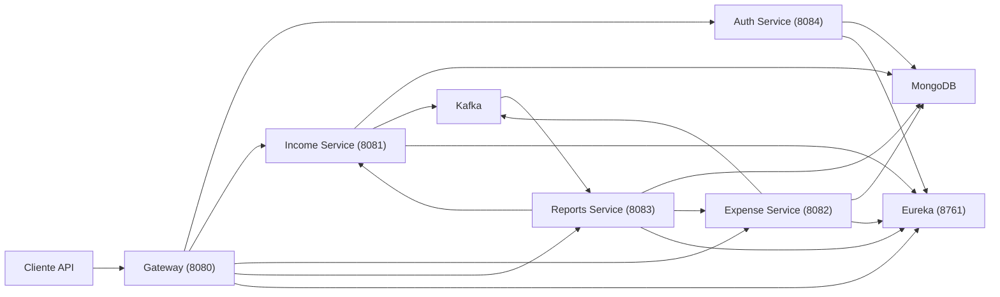

# FinFlow

Backend de gestão financeira construído com arquitetura de microsserviços para estudo avançado de Java, Spring e sistemas distribuídos.

O projeto foi pensado como uma base técnica de portfólio para demonstrar:

- autenticação com JWT
- separação de responsabilidades por serviço
- comunicação síncrona e assíncrona
- persistência orientada a documentos
- testes automatizados com cobertura validada no build
- execução local e empacotamento com Docker

## Visão geral

O FinFlow representa o núcleo backend de uma aplicação financeira capaz de:

- cadastrar usuários com e-mail e senha
- autenticar sessões via JWT
- registrar receitas
- registrar despesas
- consolidar saldo e indicadores financeiros
- gerar relatórios por período e por categoria

O objetivo do projeto é demonstrar como modelar um domínio financeiro simples em uma arquitetura distribuída, com foco em clareza estrutural, segurança básica, testabilidade e evolução incremental.

## Arquitetura



## Módulos

| Módulo | Porta | Responsabilidade |
| --- | --- | --- |
| `finflow-discovery` | `8761` | Registro e descoberta de serviços com Eureka |
| `finflow-auth` | `8084` | Cadastro, login por e-mail, emissão de JWT e recuperação de perfil |
| `finflow-gateway` | `8080` | Entrada única, validação do token e roteamento para os serviços internos |
| `finflow-income` | `8081` | CRUD de receitas e publicação de eventos |
| `finflow-expense` | `8082` | CRUD de despesas e publicação de eventos |
| `finflow-reports` | `8083` | Consolidação financeira, histórico, saldo e agrupamentos |

## Stack técnica

- Java 21
- Spring Boot 3.3.13
- Spring Cloud 2023.0.6
- Spring Cloud Gateway
- Spring Cloud Netflix Eureka
- Spring Cloud OpenFeign
- Spring Data MongoDB
- Spring for Apache Kafka
- Spring Validation
- Spring Security Crypto
- SpringDoc OpenAPI
- Maven multi-módulo
- Docker Compose
- MongoDB
- Zookeeper
- Kafka
- JUnit 5
- Mockito
- MockMvc
- JaCoCo
- GitHub Actions

## Principais funcionalidades

### Autenticação

- `POST /api/auth/register`
- `POST /api/auth/login`
- `GET /api/auth/me`
- cadastro de usuário com e-mail e senha
- autenticação stateless com JWT
- propagação do contexto autenticado para os serviços de domínio

### Receitas

- criação, listagem, atualização e remoção de receitas
- consulta de resumo por mês e ano
- publicação de eventos:
  - `income.created`
  - `income.updated`
  - `income.deleted`

### Despesas

- criação, listagem, atualização e remoção de despesas
- consulta de resumo por mês e ano
- publicação de eventos:
  - `expense.created`
  - `expense.updated`
  - `expense.deleted`

### Relatórios

- saldo consolidado
- resumo mensal
- despesas agrupadas por categoria
- histórico consolidado por período
- consolidação acionada por eventos Kafka
- leitura complementar via OpenFeign

## Fluxo de autenticação e sessão

1. o cliente registra uma conta com `POST /api/auth/register`
2. o serviço de autenticação retorna um `accessToken`
3. o cliente envia `Authorization: Bearer <token>` nas rotas protegidas
4. o gateway valida o token e propaga `X-User-Id` para os microsserviços internos
5. o cliente pode consultar o perfil autenticado com `GET /api/auth/me`

A sessão é stateless:

- o JWT representa a identidade autenticada
- o gateway não mantém sessão em memória
- os serviços internos recebem apenas o contexto necessário para autorização e segregação de dados por usuário

## Estrutura do repositório

```text
finflow/
|-- .github/
|-- docs/
|-- finflow-discovery/
|-- finflow-auth/
|-- finflow-gateway/
|-- finflow-income/
|-- finflow-expense/
|-- finflow-reports/
|-- build-finflow.ps1
|-- docker-compose.yml
|-- docker-compose.app.yml
|-- README.md
|-- start-finflow.ps1
|-- start-finflow-all.ps1
|-- stop-finflow.ps1
`-- stop-finflow-all.ps1
```

## Como executar

### Pré-requisitos

- Java 21
- Maven
- Docker Desktop
- PowerShell

### Subir a stack backend

```powershell
.\start-finflow-all.ps1
```

Esse script:

- sobe MongoDB, Zookeeper e Kafka
- inicia `finflow-discovery`
- inicia `finflow-auth`
- inicia `finflow-gateway`
- inicia `finflow-income`
- inicia `finflow-expense`
- inicia `finflow-reports`

### Parar a stack backend

```powershell
.\stop-finflow-all.ps1
```

### Build completo

```powershell
.\build-finflow.ps1
```

Para forçar limpeza antes:

```powershell
.\build-finflow.ps1 -Clean
```

### Comandos manuais úteis

```powershell
docker compose up -d
mvn verify
```

### Stack containerizada

```powershell
docker compose -f docker-compose.app.yml up --build
```

Guia complementar:

- [docs/deployment/README.md](C:/Users/hcgv1/OneDrive/Área%20de%20Trabalho/Projetos%20-%20Henrique/finFLow/docs/deployment/README.md)

## URLs locais

| Recurso | URL |
| --- | --- |
| Eureka | [http://localhost:8761](http://localhost:8761) |
| Gateway | [http://localhost:8080](http://localhost:8080) |
| Swagger Auth | [http://localhost:8084/swagger-ui.html](http://localhost:8084/swagger-ui.html) |
| Swagger Income | [http://localhost:8081/swagger-ui.html](http://localhost:8081/swagger-ui.html) |
| Swagger Expense | [http://localhost:8082/swagger-ui.html](http://localhost:8082/swagger-ui.html) |
| Swagger Reports | [http://localhost:8083/swagger-ui.html](http://localhost:8083/swagger-ui.html) |

## Endpoints principais

### Auth

- `POST /api/auth/register`
- `POST /api/auth/login`
- `GET /api/auth/me`

Exemplo de cadastro:

```json
{
  "displayName": "Maria Silva",
  "email": "maria@example.com",
  "password": "senha1234"
}
```

Exemplo de login:

```json
{
  "email": "maria@example.com",
  "password": "senha1234"
}
```

### Receitas

- `POST /api/incomes`
- `GET /api/incomes`
- `GET /api/incomes/{id}`
- `PUT /api/incomes/{id}`
- `DELETE /api/incomes/{id}`
- `GET /api/incomes/summary?month=&year=`

### Despesas

- `POST /api/expenses`
- `GET /api/expenses`
- `GET /api/expenses/{id}`
- `PUT /api/expenses/{id}`
- `DELETE /api/expenses/{id}`
- `GET /api/expenses/summary?month=&year=`

### Relatórios

- `GET /api/reports/monthly-summary?month=&year=`
- `GET /api/reports/balance`
- `GET /api/reports/by-category?month=&year=`
- `GET /api/reports/history`

## Qualidade e testes

O projeto possui:

- testes unitários de service
- testes de controller
- testes do `finflow-auth`
- testes do filtro JWT no gateway
- testes de producers e consumer
- cobertura validada com JaCoCo no `mvn verify`
- cenários BDD para fluxos críticos

Cobertura bruta atual:

- `finflow-auth`: `90.00%`
- `finflow-gateway`: `96.61%`
- `finflow-income`: `84.92%`
- `finflow-expense`: `84.42%`
- `finflow-reports`: `92.28%`

Documentação complementar:

- guia de testes: [docs/testing/README.md](C:/Users/hcgv1/OneDrive/Área%20de%20Trabalho/Projetos%20-%20Henrique/finFLow/docs/testing/README.md)
- baseline de cobertura: [docs/testing/coverage-status.md](C:/Users/hcgv1/OneDrive/Área%20de%20Trabalho/Projetos%20-%20Henrique/finFLow/docs/testing/coverage-status.md)
- cenários BDD: [docs/testing/bdd/README.md](C:/Users/hcgv1/OneDrive/Área%20de%20Trabalho/Projetos%20-%20Henrique/finFLow/docs/testing/bdd/README.md)

## CI e deploy

O projeto inclui:

- workflow de CI em [`.github/workflows/ci.yml`](C:/Users/hcgv1/OneDrive/Área%20de%20Trabalho/Projetos%20-%20Henrique/finFLow/.github/workflows/ci.yml)
- Dockerfiles por serviço backend
- compose dedicado para a stack completa em contêineres


