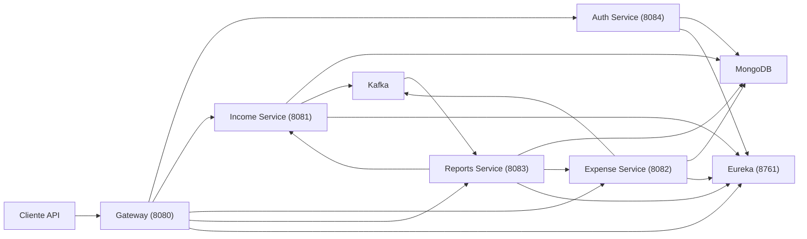

# FinFlow

Plataforma backend de gestao financeira construida para estudo avancado de microsservicos com Java e Spring.

O projeto demonstra, em um unico repositorio:

- service discovery com Eureka
- microsservico de autenticacao com cadastro e login por email
- API Gateway com validacao JWT
- servicos de dominio para receitas e despesas
- comunicacao assincrona com Kafka
- consolidacao de relatorios com MongoDB e OpenFeign
- testes automatizados com cobertura validada no build
- CI e preparo de deploy com Docker

## Visao geral

O FinFlow representa o backend de uma aplicacao financeira capaz de registrar movimentacoes, autenticar usuarios e consolidar informacoes em uma arquitetura distribuida.

Hoje o sistema permite:

- cadastrar conta com email e senha
- autenticar e recuperar sessao via JWT
- cadastrar receitas
- cadastrar despesas
- consultar saldo consolidado
- consultar resumo mensal
- visualizar despesas por categoria
- acompanhar historico mensal consolidado

## Arquitetura



## Modulos

| Modulo | Porta | Responsabilidade |
| --- | --- | --- |
| `finflow-discovery` | `8761` | Registro e descoberta de servicos |
| `finflow-auth` | `8084` | Cadastro, login por email, emissao de JWT e perfil autenticado |
| `finflow-gateway` | `8080` | Entrada unica, validacao JWT e roteamento |
| `finflow-income` | `8081` | CRUD de receitas e publicacao de eventos |
| `finflow-expense` | `8082` | CRUD de despesas e publicacao de eventos |
| `finflow-reports` | `8083` | Consolidacao financeira e consultas de relatorio |

## Stack tecnica

- Java 21
- Spring Boot 3.3.13
- Spring Cloud 2023.0.6
- Spring Cloud Gateway
- Spring Cloud Netflix Eureka
- Spring Cloud OpenFeign
- Spring Data MongoDB
- Spring for Apache Kafka
- Spring Validation
- Spring Security Crypto
- SpringDoc OpenAPI
- Maven multi-modulo
- Docker Compose
- MongoDB
- Zookeeper
- Kafka
- JUnit 5
- Mockito
- MockMvc
- JaCoCo
- GitHub Actions

## Funcionalidades

### Auth

- `POST /api/auth/register`
- `POST /api/auth/login`
- `GET /api/auth/me`
- cadastro por email e senha
- emissao de JWT
- sessao stateless baseada em token

### Gateway

- validacao de JWT
- propagacao do `X-User-Id` para servicos internos
- roteamento centralizado para `auth`, `income`, `expense` e `reports`

### Income

- criar, listar, atualizar e remover receitas
- resumo por mes e ano
- eventos:
  - `income.created`
  - `income.updated`
  - `income.deleted`

### Expense

- criar, listar, atualizar e remover despesas
- resumo por mes e ano
- eventos:
  - `expense.created`
  - `expense.updated`
  - `expense.deleted`

### Reports

- saldo consolidado
- resumo mensal
- despesas por categoria
- historico mensal
- consolidacao por Kafka
- leitura complementar via Feign

## Fluxo de autenticacao e sessao

1. cadastrar conta com `POST /api/auth/register`
2. receber `accessToken`
3. enviar `Authorization: Bearer <token>` nas rotas protegidas
4. recuperar o perfil atual com `GET /api/auth/me`

A sessao do usuario e stateless:

- o token JWT representa a sessao autenticada
- o gateway valida o token e propaga `X-User-Id` para os servicos internos
- nao existe armazenamento de sessao em memoria no gateway

## Estrutura do repositorio

```text
finflow/
|-- .github/
|-- docs/
|-- finflow-discovery/
|-- finflow-auth/
|-- finflow-gateway/
|-- finflow-income/
|-- finflow-expense/
|-- finflow-reports/
|-- build-finflow.ps1
|-- docker-compose.yml
|-- docker-compose.app.yml
|-- README.md
|-- start-finflow.ps1
|-- start-finflow-all.ps1
|-- stop-finflow.ps1
`-- stop-finflow-all.ps1
```

## Como executar

### Pre-requisitos

- Java 21
- Maven
- Docker Desktop
- PowerShell

### Subir a stack backend

```powershell
.\start-finflow-all.ps1
```

Esse script:

- sobe MongoDB, Zookeeper e Kafka
- sobe discovery, auth, gateway, income, expense e reports

### Parar a stack backend

```powershell
.\stop-finflow-all.ps1
```

### Build completo

```powershell
.\build-finflow.ps1
```

Para forcar limpeza antes:

```powershell
.\build-finflow.ps1 -Clean
```

### Comandos manuais uteis

```powershell
docker compose up -d
mvn verify
```

### Stack containerizada

```powershell
docker compose -f docker-compose.app.yml up --build
```

Guia de deploy:

- [docs/deployment/README.md](docs/deployment/README.md)

## URLs locais

| Recurso | URL |
| --- | --- |
| Eureka | [http://localhost:8761](http://localhost:8761) |
| Gateway | [http://localhost:8080](http://localhost:8080) |
| Swagger Auth | [http://localhost:8084/swagger-ui.html](http://localhost:8084/swagger-ui.html) |
| Swagger Income | [http://localhost:8081/swagger-ui.html](http://localhost:8081/swagger-ui.html) |
| Swagger Expense | [http://localhost:8082/swagger-ui.html](http://localhost:8082/swagger-ui.html) |
| Swagger Reports | [http://localhost:8083/swagger-ui.html](http://localhost:8083/swagger-ui.html) |

## Endpoints principais

### Auth

- `POST /api/auth/register`
- `POST /api/auth/login`
- `GET /api/auth/me`

Exemplo de cadastro:

```json
{
  "displayName": "Maria Silva",
  "email": "maria@example.com",
  "password": "senha1234"
}
```

Exemplo de login:

```json
{
  "email": "maria@example.com",
  "password": "senha1234"
}
```

### Receitas

- `POST /api/incomes`
- `GET /api/incomes`
- `GET /api/incomes/{id}`
- `PUT /api/incomes/{id}`
- `DELETE /api/incomes/{id}`
- `GET /api/incomes/summary?month=&year=`

### Despesas

- `POST /api/expenses`
- `GET /api/expenses`
- `GET /api/expenses/{id}`
- `PUT /api/expenses/{id}`
- `DELETE /api/expenses/{id}`
- `GET /api/expenses/summary?month=&year=`

### Relatorios

- `GET /api/reports/monthly-summary?month=&year=`
- `GET /api/reports/balance`
- `GET /api/reports/by-category?month=&year=`
- `GET /api/reports/history`

## Qualidade e testes

O projeto possui:

- testes unitarios de services
- testes de controllers
- testes do auth service e do filtro JWT no gateway
- testes de producers e consumer
- cobertura validada com JaCoCo no `mvn verify`
- roteiros BDD para fluxos criticos

Documentacao complementar:

- guia de testes: [docs/testing/README.md](docs/testing/README.md)
- baseline de cobertura: [docs/testing/coverage-status.md](docs/testing/coverage-status.md)
- cenarios BDD: [docs/testing/bdd/README.md](docs/testing/bdd/README.md)

## CI e deploy

O projeto inclui:

- workflow de CI em `.github/workflows/ci.yml`
- Dockerfiles por servico backend
- compose dedicado para a stack backend completa

## Limitacoes atuais

- ainda nao existe refresh token
- ainda nao existe recuperacao de senha, confirmacao de email ou revogacao de token
- o ambiente local pode acumular dados no Mongo quando o mesmo usuario e reutilizado repetidamente

## Proximos passos

- adicionar Testcontainers
- adicionar observabilidade
- automatizar deploy em cloud
- adicionar refresh token e revogacao
- evoluir politicas de seguranca e identidade

## Autor

Projeto desenvolvido para estudo avancado de backend Java, microsservicos e portfolio tecnico.
